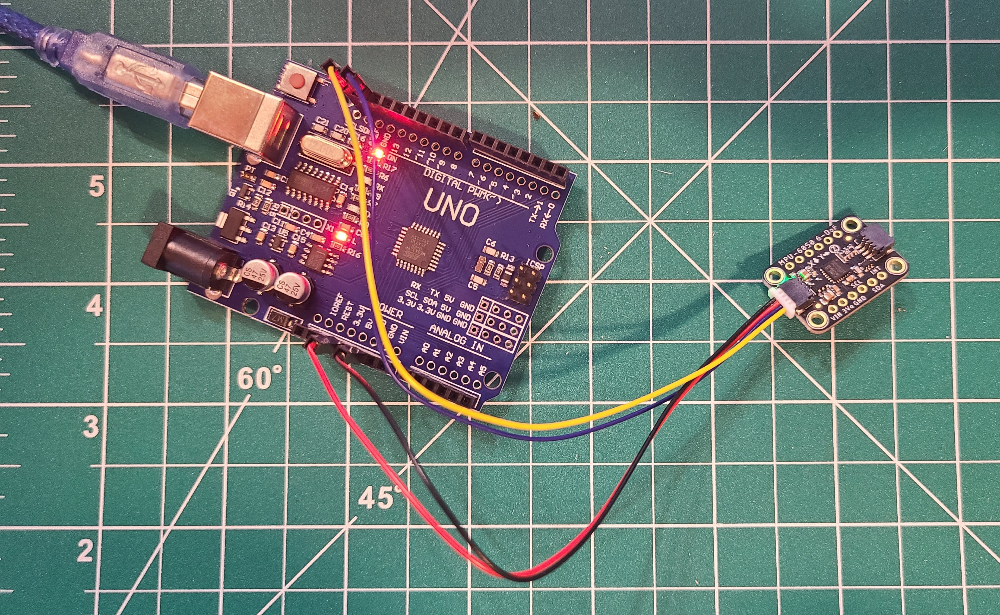

**Edit 1 (3/8/20):** I got into an accident yesterday and I wasn't able to get my clock working with the accelerometer yet (thus no demo).
**Edit 2 (3/13/20):** Unfortunately lab 3 didn't help too much on my accelerometer issues, but I managed to make a semi-working solution (without solving the IMU drift issue).

# The Clock of Pi

Does it feel like time is moving strangely during the pandemic?

For our first Pi project, we will pay homage to the [timekeeping devices of old](https://en.wikipedia.org/wiki/History_of_timekeeping_devices) by making simple clocks.

It is worth spending a little time thinking about how you mark time, and what would be useful in a clock of your own design.

**Please indicate anyone you collaborated with on this Lab here.**
Be generous in acknowledging their contributions! And also recognizing any other influences (e.g. from YouTube, Github, Twitter) that informed your design. 

## Prep

[Lab prep](prep.md) is extra long this week! Make sure you read it over in time to prepare for lab on Wednesday.

### Get your kit
If you are overseas, you should have already ordered your parts.

If you are remote but in the US, the teaching team mailed parts last week.

If you are in New York, you can pick up your parts. If you have not picked up your parts by class you should come to Tata 351.

### Set up your Lab 2

1. [Pull changes from the Interactive Lab Hub](https://github.com/FAR-Lab/Developing-and-Designing-Interactive-Devices/blob/2021Spring/readings/Submitting%20Labs.md#to-pull-lab-updates) so that you have your own copy of Lab 2 on your own lab hub. (This may have to be done again at the start of lab on Wednesday.)

In terminal cd into your Interactive-Lab-Hub folder and run 

```
Interactive-Lab-Hub $ git remote add upstream https://github.com/FAR-Lab/Interactive-Lab-Hub.git
Interactive-Lab-Hub $ git pull upstream Spring2021
Interactive-Lab-Hub $ git add .
Interactive-Lab-Hub $ git commit -m'merge'
Interactive-Lab-Hub $ git push
```

Your local and remote should now be up to date with the most recent files.

2. Go to the [lab prep page](prep.md) to inventory your parts and set up your Pi.


## Overview
For this assignment, you are going to 

A) [Connect to your Pi](#part-a)  

B) [Try out cli_clock.py](#part-b) 

C) [Set up your RGB display](#part-c)

D) [Try out clock_display_demo](#part-d) 

E) [Modify the code to make the display your own](#part-e)

F) [Make a short video of your modified barebones PiClock](#part-f)

G) [Sketch and brainstorm further interactions and features you would like for your clock for Part 2.](#part-g)

## The Report
This readme.md page in your own repository should be edited to include the work you have done. You can delete everything but the headers and the sections between the **stars**. Write the answers to the questions under the starred sentences. Include any material that explains what you did in this lab hub folder, and link it in the readme.

Labs are due on Mondays. Make sure this page is linked to on your main class hub page.

## Part A. 
## Connect to your Pi
Just like you did in the lab prep, ssh on to your pi. Once there create a python environment.

```
ssh pi@ixe00
pi@ixe00:~ $ virtualenv circuitpython
pi@ixe00:~ $ source circuitpython/bin/activate
(circuitpython) pi@ixe00:~ $ 

```

## Part B. 
### Try out the Command Line Clock
Clone the repo for this assignment

```
(circuitpython) pi@ixe00:~$ git clone https://github.com/YOURGITID/Interactive-Lab-Hub.git
(circuitpython) pi@ixe00:~$ cd Interactive-Lab-Hub/Lab\ 2/
(circuitpython) pi@ixe00:~/Interactive-Lab-Hub $ 
```

Install the packages from the requirements.txt and run the example

```
(circuitpython) pi@ixe00:~/Interactive-Lab-Hub $ pip install -r requirements.txt
(circuitpython) pi@ixe00:~/Interactive-Lab-Hub/Lab 2 $ python cli_clock.py 
02/24/2021 11:20:49
```
you can press `ctrl-c` to exit.
If you're unfamiliar with the code in `cli_clock.py` have a look at [this refresher](https://hackernoon.com/intermediate-python-refresher-tutorial-project-ideas-and-tips-i28s320p). If you're still concerned please reach out to the teaching staff!


## Part C. 
## Set up your RGB Display
We will introduce you to the [Adafruit MiniPiTFT](https://www.adafruit.com/product/4393) and Python on the Pi.


The Raspberry Pi 4 has a variety of interfacing options. When you plug the pi in the red power LED turns on. Any time the SD card is accessed the green LED flashes. It has standard USB ports and HDMI ports. Less familiar it has a set of 20x2 pin headers that allow you to connect a various peripherals.


To learn more about any individual pin and what it is for go to [pinout.xyz](https://pinout.xyz/pinout/3v3_power) and click on the pin. Some terms may be unfamiliar but we will go over the relevant ones as they come up.

### Hardware

From your kit take out the display and the [Raspberry Pi 4](https://www.adafruit.com/product/4296 | width=200)

Line up the screen and press it on the headers. The hole in the screen should match up with the hole on the raspberry pi.

<p float="left">


</p>

#### Testing your Screen

The display uses a communication protocol called [SPI](https://www.circuitbasics.com/basics-of-the-spi-communication-protocol/) to speak with the raspberry pi. We won't go in depth in this course over how SPI works. The port on the bottom of the display connects to the SDA and SCL pins used for the I2C communication protocol which we will cover later. GPIO (General Purpose Input/Output) pins 23 and 24 are connected to the two buttons on the left. GPIO 22 controls the display backlight.

We can test it by typing 
```
python screen_test.py
```

You can type the name of a color then press either of the buttons to see what happens on the display. take a look at the code with
```
cat screen_test.py
```

#### Displaying Info
You can look in `stats.py` for how to display text on the screen

#### Displaying an image

You can look in `image.py` for an example of how to display an image on the screen. Can you make it switch to another image when you push one of the buttons?


## Part D. 
## Set up the Display Clock Demo

In `screen_clock.py`. Show the time by filling in the while loop. You can use the code in `cli_clock.py` and `stats.py` to figure this out.

See code [here](screen_clock.py).

## Part E.
## Modify the barebones clock to make it your own

Does time have to be linear?  How do you measure a year? [In daylights? In midnights? In cups of coffee?](https://www.youtube.com/watch?v=wsj15wPpjLY)

Can you make time interactive? You can look in `screen_test.py` for examples for how to use the buttons.

**A copy of your code should be in your Lab 2 Github repo.**

you can push to your personal github repo by adding the files here, commiting and pushing.

```
git add .
git commit -m'your message here'
git push
```

After that, git will ask you to login to your github account to upload.

See [`timer.py`](timer.py). Push the A button to start or stop the timer, the B button to lap, and both buttons to reset.

## Part F. 
## Make a short video of your modified barebones PiClock

**Take a video of your PiClock.**

See video of my PiChronometer [here](https://youtu.be/KWhlTXadzzY). For code, see [`timer.py`](timer.py).

[](http://www.youtube.com/watch?v=KWhlTXadzzY "Timer Demo")

## Part G. 
## Sketch and brainstorm further interactions and features you would like for your clock for Part 2.


- I wanted to make a digital hourglass, but after some research, the coding required would be extensive
- Use nobs and sound output to make a timer that rings
- maybe something similar to the t-rex obstacle course on google chrome?


## Prep for Part 2

1. Pick up remaining parts for kit.

2. Look at and give feedback on the Part G. for at least 2 other people in the class (and get 2 people to comment on your Part G!)

# Lab 2 Part 2

Pull Interactive Lab Hub updates to your repo.

Modify the code from last week's lab to make a new visual interface for your new clock. You may [extend the Pi](Extending%20the%20Pi.md) by adding sensors or buttons, but this is not required.

As always, make sure you document contributions and ideas from others explicitly in your writeup.

You are permitted (but not required) to work in groups and share a turn in; you are expected to make equal contribution on any group work you do, and N people's group project should look like N times the work of a single person's lab. What each person did should be explicitly documented. Make sure the page for the group turn in is linked to your Interactive Lab Hub page. 

## Wacky Relativity Clock

### Rationale
Although the hour glass simulation looked really hard to do, I really wanted to use the gyro/accelerometer sensor in our kit! I was trying to think of ways a gyro sensor could be useful for a clock, and at first I only though of flipping- or shaking-induced actions from the clock. After some brainstorming, I remembered this super cool thing called [time dialation](https://en.wikipedia.org/wiki/Time_dilation). What if my clock slowed down up depending on the speed percieved by the accelerometer, just like time slows down when moving at the speed of light? I have thus decided to make a [wacky relativity clock](wacky_relativity.py).


### Process

#### Wacky Relativity

According to special relativity, when two bodies are moving at different speeds, each body percieves that the other one's time is going slower by a very very small increment. 
This increment is the Lorenz factor, which is given  by the following:


My relative clock gives the relative time, assuming that c=2.9979248e3, which is obviosuly much much smaller than the actual speed of light!


#### MPU6050 Calibration
First, I had to calibrate the MPU6050. After trying (and failing) to do so with the pi, I decided to use an Arduino UNO since the tutorials were more straightforward. I hooked the MPU6050 to a UNO plugged into my laptop using the Arduino configuration in (this manual)[https://cdn-learn.adafruit.com/downloads/pdf/mpu6050-6-dof-accelerometer-and-gyro.pdf]. 

See the setup below:



I then followed (this tutorial)[https://www.instructables.com/MPU6050-Setup-and-Calibration-Guide/] to find the optimal offsets.

I got the following output:

```
Initializing I2C devices...
Testing device connections...
MPU6050 connection successful
PID tuning Each Dot = 100 readings
>......>......
at 600 Readings

//           X Accel  Y Accel  Z Accel   X Gyro   Y Gyro   Z Gyro
//OFFSETS     3671,    2067,    1760,      79,      14,       7

>.>.700 Total Readings

//           X Accel  Y Accel  Z Accel   X Gyro   Y Gyro   Z Gyro
//OFFSETS     3671,    2067,    1758,      78,      14,       7

>.>.800 Total Readings

//           X Accel  Y Accel  Z Accel   X Gyro   Y Gyro   Z Gyro
//OFFSETS     3671,    2067,    1758,      78,      14,       8

>.>.900 Total Readings

//           X Accel  Y Accel  Z Accel   X Gyro   Y Gyro   Z Gyro
//OFFSETS     3671,    2067,    1758,      79,      13,       6

>.>.1000 Total Readings

//           X Accel  Y Accel  Z Accel   X Gyro   Y Gyro   Z Gyro
//OFFSETS     3673,    2067,    1758,      79,      14,       7


 Any of the above offsets will work nice 

 Lets proof the PID tuning using another method:
averaging 1000 readings each time
expanding:
....	XAccel			YAccel				ZAccel			XGyro			YGyro			ZGyro
 [0,0] --> [-30741,-30743]	[0,0] --> [-18079,-18080]	[0,0] --> [109,112]	[0,0] --> [-313,-313]	[0,0] --> [-53,-53]	[0,0] --> [-28,-27]
 [0,1000] --> [-30741,-22365]	[0,1000] --> [-18081,-9330]	[0,1000] --> [109,9359]	[0,1000] --> [-314,3684]	[0,1000] --> [-53,3943]	[0,1000] --> [-27,3968]
 [0,2000] --> [-30743,-13992]	[0,2000] --> [-18082,-578]	[0,2000] --> [109,18607]	[0,1000] --> [-312,3683]	[0,1000] --> [-50,3944]	[0,1000] --> [-24,3968]
 [0,3000] --> [-30743,-5615]	[0,3000] --> [-18082,8169]	[0,2000] --> [108,18605]	[0,1000] --> [-311,3684]	[0,1000] --> [-49,3942]	[0,1000] --> [-23,3968]
 [0,4000] --> [-30744,2758]	[0,3000] --> [-18081,8168]	[0,2000] --> [106,18605]	[0,1000] --> [-312,3684]	[0,1000] --> [-51,3943]	[0,1000] --> [-23,3968]

closing in:
..	XAccel			YAccel				ZAccel			XGyro			YGyro			ZGyro
 [2000,4000] --> [-13990,2758]	[1500,3000] --> [-4955,8168]	[1000,2000] --> [9355,18605]	[0,500] --> [-312,1687]	[0,500] --> [-51,1947]	[0,500] --> [-23,1974]
 [3000,4000] --> [-5619,2758]	[1500,2250] --> [-4955,1608]	[1500,2000] --> [13980,18605]	[0,250] --> [-312,686]	[0,250] --> [-51,947]	[0,250] --> [-23,972]
 [3500,4000] --> [-1432,2758]	[1875,2250] --> [-1683,1608]	[1750,2000] --> [16288,18605]	[0,125] --> [-312,186]	[0,125] --> [-51,446]	[0,125] --> [-23,472]
 [3500,3750] --> [-1432,665]	[2062,2250] --> [-36,1608]	[1750,1875] --> [16288,17435]	[62,125] --> [-65,186]	[0,62] --> [-51,194]	[0,62] --> [-23,219]
 [3625,3750] --> [-387,665]	[2062,2156] --> [-36,788]	[1750,1812] --> [16288,16866]	[62,93] --> [-65,57]	[0,31] --> [-51,70]	[0,31] --> [-23,95]
..	XAccel			YAccel				ZAccel			XGyro			YGyro			ZGyro
 [3625,3687] --> [-387,130]	[2062,2109] --> [-36,365]	[1750,1781] --> [16288,16570]	[77,93] --> [-6,57]	[0,15] --> [-51,5]	[0,15] --> [-23,32]
 [3656,3687] --> [-120,130]	[2062,2085] --> [-36,154]	[1750,1765] --> [16288,16417]	[77,85] --> [-6,26]	[7,15] --> [-25,5]	[7,15] --> [0,32]
 [3671,3687] --> [-3,130]	[2062,2073] --> [-36,50]	[1757,1765] --> [16346,16417]	[77,81] --> [-6,10]	[11,15] --> [-9,5]	[7,11] --> [0,16]
 [3671,3679] --> [-3,62]	[2067,2073] --> [-4,50]	[1757,1761] --> [16346,16385]	[77,79] --> [-6,2]	[13,15] --> [0,5]	[7,9] --> [0,8]
 [3671,3675] --> [-3,32]	[2067,2070] --> [-4,34]	[1759,1761] --> [16359,16385]	[78,79] --> [-2,2]	[13,14] --> [0,2]	[7,8] --> [0,4]
averaging 10000 readings each time
....................	XAccel			YAccel				ZAccel			XGyro			YGyro			ZGyro
 [3671,3673] --> [-3,12]	[2067,2068] --> [-4,14]	[1760,1761] --> [16380,16385]	[78,79] --> [-1,2]	[13,14] --> [-2,2]	[7,8] --> [0,4]
 [3671,3672] --> [-3,13]	[2067,2068] --> [-2,14]	[1760,1761] --> [16379,16385]	[78,79] --> [-1,2]	[13,14] --> [-2,2]	[7,8] --> [0,4]
 [3671,3672] --> [-4,13]	[2067,2068] --> [-2,14]	[1760,1761] --> [16378,16385]	[78,79] --> [-2,2]	[13,14] --> [-2,2]	[7,8] --> [0,4]
-------------- done --------------
```

~~As it turns out, these outputs aren't compatible with the python API, so I tried writing my own calibration by simply averaging measurements over 5 seconds (see code [here](mpu_calibrate.py)). 
~~

Actually, turns out my sensor does not need to be calibrated, as the number I was seeing was gravity, oops!


#### Using the MPU

So in theory, velocity is acceleration  so I though if I had a velocity counter in the while loop, I could have an approximation for speed.

After some trial and error, I realized that in practice, [finding velocity from from acceleration is not that simple](http://www.chrobotics.com/library/accel-position-velocity). 
You need to first remove gravity from the accelerometer data using the gyroscope for the correct angle. You can also run into issues if the intervals at which you are checking the acceleration is such that you miss the movement -- this can be partially fixed with a high-pass filter.

Of course, getting this all working requires basically building an [IMU](https://en.wikipedia.org/wiki/Inertial_measurement_unit)... 

For simplicity, I am therefore going to assume the sensor will only be moving in the x-y plane, with no rotations (no gravity, yay!). I did not fix the drift issue (where the velocity increases over time because the refresh rate is not high enough to capture every change in speed), so the speed is essentially only cumulative.

### Demo

Watch the demo video below:

[](http://www.youtube.com/watch?v=kVTu4pdrtA4 "")
